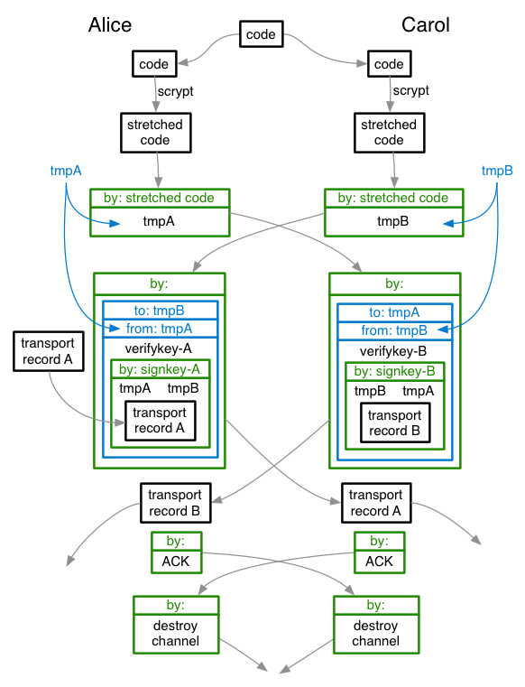
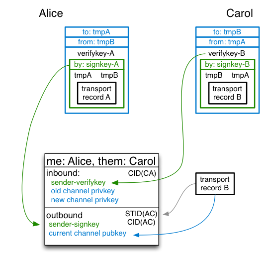

# Invitations

Petmail agents learn about each other through `Invitations`. Each invitation
creates a pair-wise connection between the two nodes: an entry is added to
each node's addressbook, pointing to the other node. These entries enable
secure communication with the other agent, and by extension, the human who
owns that node/agent.

`Invitation Codes` are short strings that deliver the invitation. They come
in two forms: randomly-generated, and shared code-phrases. Regardless of how
they are generated, eventually the code will be pasted, typed, or scanned
into both nodes by their respective human owners. The nodes will then contact
each other through the `Rendezvous Server`, exchange contact details, and
create the addressbook entries.

Randomly-generated invitation codes are strings like `ezcj-ugbe`.

Shared code-phrases can be any string the two participants can remember. They
only restriction is that they must be typed exactly the same way into each
computer. So the recommendation is to use only lower-case letters, and
separate the words with spaces. Literary phrases, famous quotes, and
well-known names should be avoided.

## Stretching

To improve the security of Petmail's relatively-short invitation codes, the
system first applies "key-stretching" to the code. It uses a fairly intense
configuration of the "scrypt" algorithm (N=256k, r=8, p=24) which requires
about 256MB and a lot of time (20 seconds on a 2013 MacBookPro with a 2.6GHz
i7, two minutes on a 1.8GHz Intel Atom, and ten minutes on a Raspberry Pi).

It also uses a "daysalt", which is a constantly-changing value that all nodes
can agree upon. Petmail gets its daysalt from the Bitcoin block chain
(specifically, a particular hash of the header of the block with the oldest
timestamp still greater than the most recent UTC midnight). For now, it makes
an HTTP request to blockexplorer.com to get this. To avoid spoofing attacks,
a future version will either include a bitcoin client, or will include a Tor
client and use a service catalog.

An 8-character randomly-generated invitation code will have 40 bits of
entropy. A four-word passphrase, with words chosen from a list of 1024
choices, will also have 40 bits. At scrypt(256k/8/24), an attacker would need
to spend $270 million each day to build a complete table of stretched
invitation codes. (see http://keywrapping.appspot.com/ for key-stretching
cost calculations)

## Rendezvous Server

All Petmail nodes use the same rendezvous server. The access coordinates are
hard-wired into the node.

This server holds a number of short-lived "channels", created on-demand, and
deleted when both parties are done with them (or after 24 hours). Each
channel holds an unsorted set of messages. All messages are signed (the
channel ID is the verifying key), allowing the server to reject noise from
non-participants (those who do not know the invitation code). Agents check
the same signatures, so they can ignore noise from the server as well.

For local development, agents also use a "local-fs" rendezvous service, which
is simply a subdirectory of the source tree named ".rendezvous". Channels
correspond to files in this directory. Files older than 15 minutes are
deleted at node startup.

## Details

The stretched invitation code is used to derive an Ed25519 signing key. From
the signing key, we derive a verifying key. The verifying key is used as a
channel identifier on the rendezvous server, which only accepts commands
signed by the matching key.

The rendezvous server maintains a short message set for each channel. It
accepts two commands. The first reads the contents of the channel, as an
unordered list of message blobs. The second appends a message to the channel,
if two conditions are met: the message signature can be verified by the
channel ID, and the message is not already in the channel. If there are two
messages whose signed bodies are the string "delete-channel", or if the
channel is more than 24 hours old, the channel is destroyed.

The first agent to contact the server posts a message that contains a signed
ephemeral Curve25519 pubkey. It then polls or subscribes to the channel,
waiting for changes.

The second agent reads that message and prepares a similar one of its own. It
also uses the two ephemeral pubkeys to create a boxed record containing its
long-term verifying key, and a signed copy of the two ephemeral pubkeys and
its transport record (listing the mailboxes it uses for inbound messages).
Both messages are added to the channel. Note that the long-term verifying key
is different for each sender (so each pair of users will involve two
verifying keys).

The transport record will include: the mailbox descriptor string (including
URL and mailbox pubkey), the sender-specific STID and CID identifiers (see
[mailbox.md](./mailbox.md)), and the current rotating pubkey (used to provide
forward-secrecy).

When generating the transport record, each agent will remember several secret
values for themselves. This includes the CID for their correspondent, the
signing key they will use for outbound messages, and the private key they'll
use to decrypt inbound messages. These secrets will be stored in the
addressbook entry.

The first agent then retrieves those messages and appends its own boxed
record. It adds the address-book entry for the peer, marking it as
"unacknowledged". It adds a third message to the channel with the string
"ack-" and a nonce.

The second agent retrieves the boxed record, creates its own address-book
entry, and adds its own ACK to the channel. When it sees the other ACK, it
marks the address-book entry as "acknowledged", and adds a "delete-channel"
message to the channel (with a nonce). At this point, it unsubscribes from
the channel (stops polling, etc).

The first agent sees the "ACK" message, marks its address-book entry as
"acknowledged", and adds its own "delete-channel" message to the channel. The
first agent now stops polling too.

The server, upon seeing both "delete-channel" messages, deletes the channel.

The complete protocol looks like this:

* A->B: MAC(by=code, tmpA)
* B->A: MAC(by=code, tmpB)
* B->A: enc(to=tmpA,from=tmpB, verfB+sig(tmpA+tmpB+transportB))
* A->B: enc(to=tmpB,from=tmpA, verfA+sig(tmpB+tmpA+transportA))
* A->B: ACK-nonce
* B->A: ACK-nonce
* B->A: destroy channel-nonce (1-of-2)
* A->B: destroy channel-nonce (2-of-2)
